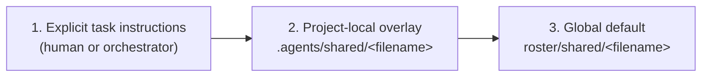

# `roster/shared/` — global defaults and per-project overrides

Every role's `AGENT.md` points at a subset of the files in this directory as
required reading (stack choices, autonomy policy, security baseline, and so
on), and `internal/generators/plugin_generation.go` embeds them
directly into every packaged role's instructions. Those files are this
repository's **global defaults**. A project using these agents can extend or,
where it makes sense, override them without editing this checkout, by
placing a same-named file at `.agents/shared/<filename>` in its own tree.

## Optionality and PII

Every file in this directory is optional as a global default: a project (or
this repository itself) may have no `team-profile.yaml` at all, or an emptied
one, and nothing should crash or hard-fail because of that -- roles proceed on
task-brief judgment when a shared file is absent, and
`internal/generators/plugin_generation.go` simply omits an absent file's section from the
generated wrappers rather than failing.

`internal/generators/plugin_generation.go` embeds these files **verbatim** into every one of
the 71+ generated role wrappers (both the Codex `.toml` wrappers committed in
this repository and the Claude Code wrappers written into the separately
published public `cadre-lifecycle` repository). Because of that, files under
`roster/shared/` must never contain personal names, emails, or other
individual-identifying data. Named human approval or escalation-contact
information (who is a project's Product Owner, on-call contact, etc.) belongs
in a consuming project's own local/untracked config or its `agentic-sdlc`
lifecycle records -- never here.

## Precedence



Highest precedence wins per file. The overlay is found by walking up from
the current directory to the nearest `.git` (the same convention
`internal/knowledge/config.go` uses for its project-local
`config.json`). Resolve the effective value with `cadre resolve-shared
<filename>` (see `internal/config/shared_overlay.go`), run from anywhere inside
the target project. It fails closed: a malformed overlay is an error, not a
silent fallback to the default.

## Merge rule by file type

- **Structured files** (`*.yaml`, `*.json` — `team-profile.yaml`,
  `library-standards.yaml`, `agent-autonomy.yaml`,
  `control-mapping-template.yaml`, `platform-impact-profile.yaml`): deep-merged,
  overlay wins per key. Keys the overlay doesn't mention keep the global
  default.
- **`agent-autonomy.yaml` specifically**: the merge is narrowing-only. This
  file is a safety control, not a preference, so a project overlay may move
  a value toward *more* restrictive (e.g. `allowed` → `human_approval`) but
  resolving raises an error if an overlay tries to loosen a `never` default
  or turn any other restricted default into `allowed`. An overlay also can't
  touch `policy_version` or `default_rule` (the fixed contract) or reference
  a key the global default doesn't define.
- **Prose files** (`*.md` — `operating-principles.md`,
  `technology-standards.md`, `cloud-guardrails.md`,
  `secure-development-policy.md`, `risk-severity-model.md`,
  `knowledge-use-policy.md`, `definition-of-done.md`, `workspace-isolation.md`,
  `documentation-style.md`):
  additive, never replaced. If an overlay exists, the resolved text is the
  global default plus an appended `## Project addendum` section. On a direct
  conflict between the default and the addendum, the more specific/restrictive
  instruction wins, per the existing rule in `operating-principles.md`.

### Tier-scoped shared policies

Every file in this directory is embedded into *every* generated role wrapper
(`SHARED_POLICIES` in `internal/generators/plugin_generation.go`). One of them,
`workspace-isolation.md`, is embedded in full for write-capable tiers and as
a **section-granular excerpt** for the rest — see the next subsection.

The module also has a `TIER_SCOPED_POLICIES` mechanism for embedding a file
only into wrappers for the capability tiers it names. **It is empty today.**
`workspace-isolation.md` was its only entry, scoped to `WRITE_CAPABLE_TIERS`,
until that file gained a section (`Never mutate a working tree you did not
create`) binding every tier regardless of write capability — at which point
tier-scoping it meant the roles least likely to be shown the rule were the
ones dispatched for read-only work. It moved to `SHARED_POLICIES`; the
mechanism stays because the question recurs.

If you do reintroduce a tier-scoped file: it follows the same
missing/emptied/present optionality rule as any `SHARED_POLICIES` file for
the tiers it applies to, and it must open with an explicit applicability
header naming those tiers, because the scoping is generated-wrapper-only.

**Any such scoping applies only to the generated wrapper, not to
`cadre resolve-shared`.** The resolver is filename-based and knows nothing
about capability tiers, so `cadre resolve-shared <file>` from any role or
shell returns the file's full resolved text — a tier gate only decides
whether `internal/generators/plugin_generation.go` embeds the section into a *specific
role's* generated wrapper instructions. That asymmetry is why a tier-scoped
file must state its own applicability in its own text: `cadre resolve-shared`
cannot do that filtering for it.

### Section-granular excerpts (`UNIVERSAL_POLICY_SECTIONS`)

`UNIVERSAL_POLICY_SECTIONS` in `internal/generators/plugin_generation.go` is a *separate*
mechanism from `TIER_SCOPED_POLICIES`, and the distinction is the whole point
(deagy/cadre#211). `TIER_SCOPED_POLICIES` answers "which tiers get this file
at all"; that file granularity is exactly what made tier-scoping
`workspace-isolation.md` wrong the first time, because dropping the file also
dropped its universally binding section. `UNIVERSAL_POLICY_SECTIONS` answers
a narrower question: **when a file's own applicability header excludes a
tier, which of its `## ` sections still bind that tier.**

A role whose capability is not in `WRITE_CAPABLE_TIERS` receives the file's
preamble (everything above its first `## ` heading — where the applicability
header lives) plus the named sections, in file order. Every other role
receives the file byte for byte. Today the only entry is
`workspace-isolation.md`, whose four universally binding sections are
`Never mutate a working tree you did not create`,
`The security-relevant-resolver rule`,
`Never remove or prune a worktree yourself`, and
`No runner names as behavioral conditions`.

**Membership is not "can this role write files."** A read-only role still
*creates* worktrees — the never-mutate section tells it to make a `--detach`
inspection worktree rather than check out a ref in someone else's tree — so
every rule about a worktree a role creates, removes, or resolves
configuration from inside binds it too. Scoping by "has edits to isolate"
alone once de-bound the never-remove-or-prune rule from exactly the roles
the excerpt instructs to create a worktree.

It fails closed, raising `PolicyExcerptError` on: a renamed or removed
heading; a named section with an empty body; a header bullet list that does
not match the registered set **in both directions** (so the header cannot
name a section the dict drops, nor the reverse); an unbalanced code fence; a
parsed section count that disagrees with the file's raw `## ` line count; an
empty section tuple (the mechanism therefore cannot be used to drop a whole
file); and, at import, a key absent from `SHARED_POLICIES`.

Two of those deserve their reasoning recorded, because both were found by
mutation testing rather than by review, and neither needs any parsing bug to
fire:

- **The section-count cross-check.** A *balanced* stray fence pair deletes
  the section boundaries between its markers, so a swallowed heading is
  absorbed into the preceding section. When that section is one of the kept
  universal ones, write-capable-only text ships to every read-only wrapper
  and the generator still exits 0 — silent in exactly the direction that
  matters, since swallowing a *dropped* section trips the missing-heading
  check instead. Checked in `excerpt_universal_sections`, not in
  `split_policy_sections`, which is a general splitter whose documented
  behavior is to ignore fenced headings.
- **The symmetric header check.** A one-directional check (every registered
  heading appears in the header) lets a new section declare in its own body
  that it binds every tier while going unregistered — the original bug
  reached by *addition* rather than rename, which is what a future editor of
  the file will actually do. The test suite closes the remaining half by
  scanning section bodies for that claim.

Section *content* is not checked here.
`internal/generators/workspace_isolation_excerpt_test.go` asserts specific rule
prose survives into the committed wrappers on both runners. Note that its
exact-excerpt test recomputes its expectation from the same function it
validates, so it guards committed-output drift, not generator logic — do not
count it as logic protection.

**Do not grow this into a general policy-envelope generator.**
`docs/investigations/policy-envelope-ceiling-2026-08.md` measured the general
case and recommends against it. A file belongs here only when it states its
own tier applicability rule in its own text, so the excerpt encodes the
file's stated rule rather than a judgment call about what a role might need.
As with tier scoping, this affects the generated wrapper only —
`cadre resolve-shared workspace-isolation.md` still returns the full file to
any caller at any tier.

## Where overlays live

```
<project-root>/
└── .agents/
    └── shared/
        ├── team-profile.yaml          # overrides roster/shared/team-profile.yaml
        ├── agent-autonomy.yaml        # narrowing-only overrides
        └── technology-standards.md    # appended as a project addendum
```

Only files a project actually wants to extend or override need to exist
under `.agents/shared/`; anything absent resolves straight to the global
default.

### The three things that live under `.agents/`

`.agents/` hosts three separate project-local mechanisms. They look alike
and are **not** interchangeable — each has its own resolver, merge rule,
and, most importantly, its own trust posture. Read the trust column before
adding anything here.

| Path | What it is | Trust | Merge |
| --- | --- | --- | --- |
| `.agents/shared/<filename>` | Policy overlays — this document | **Trusted.** Alters agent policy; `agent-autonomy.yaml` is narrowing-only so an overlay can tighten but never loosen autonomy. | Deep-merged over the global default (`internal/config/shared_overlay.go`) |
| `.agents/knowledge-store/config.json` | Knowledge-store configuration | Security-relevant. Its *presence* selects the project-local tier, which gates database confinement, prohibits remote embeddings, and changes `--source` enforcement. | Own three-tier resolver (`internal/knowledge/config.go`) |
| `.agents/cadre.yaml` (or `.json`) | Operator settings — endpoints, binary paths, store location | **Untrusted.** Arrives with `git clone` and is editable by anyone who can open a pull request. Fields that select an executable, a data-store location, or a token-receiving destination are `global_only` and are rejected outright if set here. | First-wins precedence, no merging (`internal/config`) |

The asymmetry is deliberate. A policy overlay can only ever *narrow* what
agents may do, so trusting it is safe. An operator setting picks which
binary gets executed and where a service token is sent, so a file that
travels with a repository must not be able to choose it — see
`roster/RUNBOOK.md`'s configuration section for the full trust-scope table
and the reasoning behind each `global_only` field.

`.agents/knowledge-store/config.json` is deliberately **not** folded into
`.agents/cadre.yaml`: only its `home` directory is an operator setting, and
that one field now resolves through `internal/config` as a lower-precedence
fallback beneath `KNOWLEDGE_STORE_HOME`. The rest of that file is store
schema, and its tier detection is load-bearing security state that a second
resolver must not perturb.

## Generating overlays with `cadre init`

Rather than hand-authoring `.agents/shared/<filename>` overlays from scratch,
run `cadre init [<project-root>]` (see
`internal/cli/init.go`). It covers three sections (`--sections`
restricts to a comma-separated subset; default: all):

- **RG-A** — stack/tooling opinions.
- **RG-B** — governance/autonomy narrowing, via a closed allowlist for
  `agent-autonomy.yaml` (never free text).
- **RG-C** — guided `platform-impact-profile.yaml` fill-in.

**Start from the defaults; override only what differs.** There are three
levels of effort, and the first one is the default:

```sh
cadre init                                                # installed command: use the enclosing Git worktree
cadre init .                                              # installed command: explicitly use the current directory
cadre init <project-root> --set platform.hosting_model=cloud --force
cadre init <project-root> --interactive --force           # review every group
./bin/cadre init <project-root>                            # from this Cadre checkout: target another project
```

`--target <project-root>` remains accepted for compatibility, but cannot be
combined with the positional project root. When no root is supplied, `init`
uses Git to locate the enclosing worktree (including linked worktrees and
submodules). Outside a Git worktree, supply a root explicitly rather than
having an incidental CWD become a write target. It still refuses to initialize
this Cadre checkout or another Cadre checkout.

Accordingly, do not run `./bin/cadre init` with no target from this Cadre
checkout: inference selects the checkout itself and the self-checkout guard
will refuse it. Use an installed `cadre` command from the target worktree, or
pass the target path to this checkout's `./bin/cadre` launcher.

The initializer's `--interactive` starts the overlay questionnaire. The
leading dispatcher flag in `cadre --interactive init` has a different purpose:
it permits prompting for missing operator settings, but does not start that
questionnaire. Use `cadre init --interactive` for the questionnaire, or
`cadre --interactive init --interactive` when both behaviors are needed.

A run with no answer source keeps every shipped default and **plans no writes
at all**. That is not a degraded outcome: overlays are sparse, so "keep the
default" means "write no overlay for that field", and a project with no
overlay resolves to exactly the shipped values. It is also the safest run
available — it cannot weaken a governance posture, because it changes nothing.

### Inspecting shared-policy overlays

Use `cadre init [<project-root>] --repair` to validate and inventory
the six overlays this initializer manages. It is always read-only; `--apply`
is accepted only as an explicit acknowledgement and still makes no changes.
Missing overlays are reported as healthy because they inherit shipped defaults.
Existing overlays are protected project decisions, including entries whose
platform applicability is still `unknown`.

Repair does not re-run initialization, recreate sparse overlays, resolve
unknown applicability, or overwrite policy. It fails closed on malformed
structured data, a non-narrowing autonomy overlay, an unsafe overlay path, or
an incomplete/ambiguous `agents-init` managed block. Correct those cases
manually, then use the normal reviewed change flow (`--set`, `--answers`, or
`--interactive` with `--force`) when a policy update is intended.

Key behavior:

- Nothing is written without `--force` (omitting it previews only), and every
  generated overlay is validated by resolving it exactly as `cadre
  resolve-shared` would before success is reported.
- `--set [REGION:]PATH=VALUE` (repeatable) overrides one field without an
  answer file, and records the `field_decisions` entry the schema requires.
  The region (`stack`, `libraries`, `autonomy`, `platform`) is **derived** by
  looking the path up in the shipped defaults, never taken from the operator —
  that is what keeps the `stack`/`governance` category honest. A path no
  shipped default defines, or one that is ambiguous across regions (e.g.
  `policy_version`, which exists in both `library-standards.yaml` and
  `agent-autonomy.yaml`), fails closed and asks for a `REGION:` qualifier.
  `--set` wins over both `--answers` and `--stack`, and is mutually exclusive
  with `--interactive`.
- A `--set` on an `agent-autonomy.yaml` field goes through the same allowlist
  and narrowing check as every other path: it can only ever *narrow*, and a
  rejected value is redacted to a hash exactly as in the prompt flow.
- Answer the run non-interactively with `--answers <file.yaml>`
  (`schema_version: 1`, documented in `internal/cli/init.go`'s header —
  the same shape `--print-answers` echoes back, so a prior run is directly
  reusable), or interactively with `--interactive`. `--answers` and
  `--interactive` are mutually exclusive; neither is required.
- `--interactive` gates each *group* of fields behind one question (`Review 14
  stack field(s) under 'frontend'? [y/N]`) rather than prompting per leaf, so
  the floor is ~30 questions instead of ~160. Declining a group keeps its
  shipped defaults — safe for RG-B too, since the autonomy check only ever
  permits narrowing, so a field nobody reviewed keeps the most restrictive
  value it shipped with.
- `--stack <preset-id>` names a static, human-reviewed, RG-A-only starter
  preset from `roster/shared/init-presets/*.yaml` (never touches
  `agent-autonomy.yaml` or `cloud-guardrails.md`) as interactive defaults or
  an `--answers` merge base (the answer file's own values win). A preset needs
  no answer file: on a defaults run its `field_decisions` are synthesized,
  since a preset is structurally forbidden from touching governance.
- `--print-answers` echoes the resolved, validated answer set for
  reproducibility; `agent-autonomy.yaml`/`cloud-guardrails.md` fields are
  redacted there to an `accepted`/`rejected` status plus a sha256 hash — the
  raw value is never printed, only ever written to the audit log or the
  resulting overlay file.
- `technology-standards.md` and `cloud-guardrails.md` overlays use a managed
  block (`<!-- agents-init:managed:start/end -->`): reruns accumulate new
  entries there (deduping exact duplicates) without touching content a human
  added outside the block.
- Every answered field needs a `field_decisions` entry
  (`kept`/`overridden`/`deferred` status, plus a `stack` or `governance`
  category); `cadre init` fails closed (no writes) on a missing decision or a
  category that doesn't match the field's actual file. Coverage is only
  required for fields an answer set actually supplies a value for, which is
  why a defaults-only run needs no decisions at all. A hand-authored
  `--answers` file still fails closed on a missing decision — the synthesis
  described above applies only to a defaults-mode run.

## The platform impact profile

`platform-impact-profile.yaml` defines the impact-category and BOM vocabulary for
an external organization/platform this repository deliberately does not
define the semantics of (see `docs/terminology.md`'s platform entry) — a
consuming project supplies its own authorized definitions and owners, and
`unknown` blocks the relevant gates by design in whatever system enforces
that lifecycle (this repository's own run-record/quality-gate machinery was
intentionally removed in favor of the standalone Agentic SDLC kernel; see
`bin/cadre sdlc`). A project overlay of this file follows the same
structured-file merge rule as any other shared default — it can pre-fill a
project's own applicability decisions as a starting template, not just leave
every category `unknown`.
