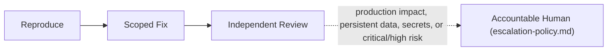

# Debugging Workflow

Hermes analog of the cadre workflow playbook. Steps name cadre roles; each role is an installed Hermes skill under the `cadre/` category (skill name = role id). Dispatch each step's role via `delegate_task` (independent steps in one parallel batch), passing that skill's contract + the step's inputs as `context`. Consult `cadre-orchestrator` for role selection, gates, and escalation.

Where the playbook text references `cadre` CLI commands, `roster/` repository paths, or selector machinery, that describes the upstream system: substitute the `cadre-orchestrator` dispatch protocol and its knowledge-retrieval analog; the gate semantics, evidence requirements, and stop conditions still bind.

This workflow carries no fixed lifecycle gate (`routing.json`'s `debugging`
route declares no `quality_gates`); stop conditions are governed by
`orchestration/escalation-policy.md` instead.

1. **Dispatcher:** Attach the issue report, failing command, logs, changed paths, environment, and authorized knowledge context. Record unavailable or blocked retrieval.
2. **Debugging engineer:** Reproduce the issue or prove it is unreproducible, isolate the smallest likely cause, and identify whether the defect is in code, configuration, tests, runtime, documentation, or agent orchestration.
3. **Specialist support:** Bring in frontend, backend, infrastructure, CI/CD, security, support, or agent-authoring expertise only for the affected boundary.
4. **Scoped fix:** Apply the smallest authorized change, including agent-definition or routing tune-ups when the task includes agent-system debugging. Do not weaken controls, skip gates, or broaden scope.
5. **Regression proof:** Add or update deterministic tests where practical, rerun the failing check, and capture exact commands, outputs, and remaining gaps.
6. **Independent review:** Route changed code to code review, changed tests to test review, changed infrastructure to infrastructure review, changed pipelines to pipeline-security review, and changed roster/routing to an independent orchestration or code review.
7. **Escalation:** Stop for production impact, persistent data, identity or secret exposure, customer data, critical/high security risk, ambiguous ownership, destructive remediation, or human-only decisions.

Completion requires root-cause evidence, a scoped fix or documented non-reproducibility, regression coverage or a justified gap, passing relevant validation, and an independent-review handoff tied to the exact revision.
