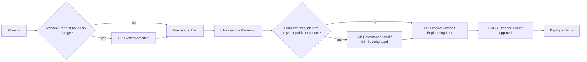

# Infrastructure Change Workflow

Hermes analog of the cadre workflow playbook. Steps name cadre roles; each role is an installed Hermes skill under the `cadre/` category (skill name = role id). Dispatch each step's role via `delegate_task` (independent steps in one parallel batch), passing that skill's contract + the step's inputs as `context`. Consult `cadre-orchestrator` for role selection, gates, and escalation.

Where the playbook text references `cadre` CLI commands, `roster/` repository paths, or selector machinery, that describes the upstream system: substitute the `cadre-orchestrator` dispatch protocol and its knowledge-retrieval analog; the gate semantics, evidence requirements, and stop conditions still bind.

Gate set cross-checked against `routing.json`'s `infrastructure` route (`G3, G4, G5, G6, G7, G8`) and `roster/authority/aides.yaml`.

1. Classify scope, environment, affected data, blast radius, architecture impact, and required approvals.
2. If architecture or trust boundaries change, require cloud architect and threat modeler review before implementation.
3. Infrastructure provisioner updates IaC and produces validation evidence plus a plan tied to the exact revision and target.
4. Infrastructure reviewer independently evaluates code and plan, explicitly covering create/update/replace/delete, IAM, exposure, encryption, logging, backup, data, state, cost, and rollback effects.
5. Security and compliance reviewers participate when the change affects scoped controls, sensitive data, identity, keys, public exposure, logging, or recovery.
6. Release engineer verifies the reviewed plan still matches the approved revision and target, then obtains required human approval.
7. A scoped deployment identity applies the reviewed plan. Do not re-plan silently during production apply.
8. Verify health, security telemetry, drift, policy state, and expected resources. Roll back or escalate on threshold failure.

Always stop for unexpected deletion/replacement, privilege expansion, public exposure, state manipulation, key changes, data migration, or target ambiguity.
