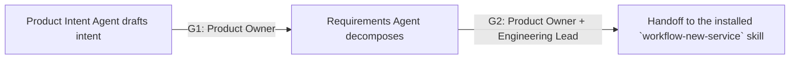

# Product Intake Workflow

Hermes analog of the cadre workflow playbook. Steps name cadre roles; each role is an installed Hermes skill under the `cadre/` category (skill name = role id). Dispatch each step's role via `delegate_task` (independent steps in one parallel batch), passing that skill's contract + the step's inputs as `context`. Consult `cadre-orchestrator` for role selection, gates, and escalation.

Where the playbook text references `cadre` CLI commands, `roster/` repository paths, or selector machinery, that describes the upstream system: substitute the `cadre-orchestrator` dispatch protocol and its knowledge-retrieval analog; the gate semantics, evidence requirements, and stop conditions still bind.

Use this workflow when work has not yet entered architecture or implementation.

1. Dispatcher records scope, classification, human owner, exclusions, source references, and authorized knowledge-retrieval status.
2. Product Intent Agent drafts a versioned intent record covering users, outcomes, scope, exclusions, constraints, environments, and measurable success criteria. It does not set priority, resolve mission ambiguity, or approve intent.
3. Human Product Owner resolves conflicts, sets priority, and approves or rejects G1.
4. Requirements Agent decomposes approved intent into stable requirement IDs, acceptance criteria, dependencies, non-functional requirements, controls, tests, evidence obligations, trace links, and downstream gate applicability.
5. Governance Planner, Data Governance Engineer, and Cryptographic Assurance Engineer provide early applicability input and a fail-closed platform impact profile without inventing undefined semantics.
6. Human Product Owner and Engineering Lead approve or reject G2.
7. On approval, hand off the immutable intent and requirements baseline, traceability graph, platform profile, open findings, and evidence hashes to `the installed `workflow-new-service` skill`. Objective conflicts return to G1.

Neither agent may approve, prioritize, cancel, accept risk, or make a persistent
environment change. Missing ownership, conflicting objectives, or unknown
applicable platform semantics block the handoff.
