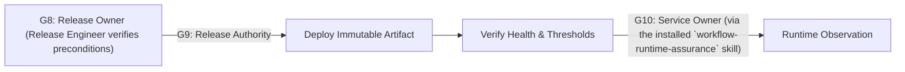

# Production Release Workflow

Hermes analog of the cadre workflow playbook. Steps name cadre roles; each role is an installed Hermes skill under the `cadre/` category (skill name = role id). Dispatch each step's role via `delegate_task` (independent steps in one parallel batch), passing that skill's contract + the step's inputs as `context`. Consult `cadre-orchestrator` for role selection, gates, and escalation.

Where the playbook text references `cadre` CLI commands, `roster/` repository paths, or selector machinery, that describes the upstream system: substitute the `cadre-orchestrator` dispatch protocol and its knowledge-retrieval analog; the gate semantics, evidence requirements, and stop conditions still bind.

## Preconditions (G8 Release Readiness)

- The standalone Agentic SDLC lifecycle record shows G1-G7 and all applicable specialist attestations approved for the exact release inputs.
- Artifact digests, source revision, provenance, SBOM, plans, approvals, change window, owners, verification thresholds, and rollback are recorded.
- Critical/high findings are resolved or covered by authorized, time-bound exceptions.

## Execution

1. Release engineer validates preconditions and prevents conflicting releases.
2. Authorized Human Release Authority decides G9 for the exact artifact, environment, deployment identity, plan, window, blast radius, rollback, and verification thresholds. Any mismatch, substitution, or stale approval returns to G8.
3. Scoped deployment identity promotes and deploys the immutable artifact, progressively where appropriate.
4. Test engineer or automated verification checks health, security, business, data-integrity, and observability thresholds. When capacity or resilience claims were validated at G6, confirm performance testing engineer's and chaos & resilience engineer's results still hold for this exact artifact and target rather than re-trusting stale results from an earlier revision.
5. Release engineer records the result; technical writer and evidence curator update release documentation and evidence without approving or manufacturing it.
6. Continue with `the installed `workflow-runtime-assurance` skill`; the Human Service Owner decides G10 after the defined observation window.

## Stop conditions

Stop and roll back or invoke incident response on identity mismatch, artifact mismatch, failed migration, unavailable telemetry, breached error/latency/security thresholds, unexpected infrastructure actions, or unverifiable state.
