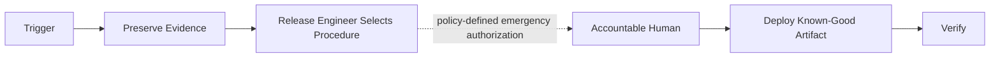

# Rollback Workflow

Hermes analog of the cadre workflow playbook. Steps name cadre roles; each role is an installed Hermes skill under the `cadre/` category (skill name = role id). Dispatch each step's role via `delegate_task` (independent steps in one parallel batch), passing that skill's contract + the step's inputs as `context`. Consult `cadre-orchestrator` for role selection, gates, and escalation.

Where the playbook text references `cadre` CLI commands, `roster/` repository paths, or selector machinery, that describes the upstream system: substitute the `cadre-orchestrator` dispatch protocol and its knowledge-retrieval analog; the gate semantics, evidence requirements, and stop conditions still bind.

This workflow carries no fixed `G1`-`G10` gate; the deciding authority is
whichever accountable human policy designates for emergency authorization.

1. Declare the trigger, incident/change identifier, decision owner, affected environment, and current blast radius.
2. Preserve logs, events, artifact identifiers, plans, and relevant state before changing the system when safe.
3. Release engineer selects the pre-approved rollback or roll-forward procedure; obtain emergency authorization required by policy.
4. Use the scoped deployment identity and immutable known-good artifacts. Do not improvise source changes inside the release process.
5. Account for database/schema compatibility, irreversible data changes, queued work, caches, DNS, keys, and infrastructure state.
6. Verify service health, security signals, data integrity, and customer impact after recovery.
7. Evidence curator records the timeline and artifacts; reviewers identify follow-up findings without delaying urgent containment.

Escalate to incident response when compromise, data loss/exposure, state corruption, or safe recovery uncertainty is suspected.
