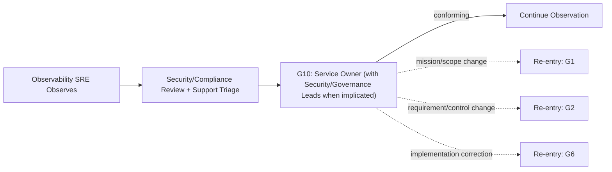

# Runtime Assurance Workflow

Hermes analog of the cadre workflow playbook. Steps name cadre roles; each role is an installed Hermes skill under the `cadre/` category (skill name = role id). Dispatch each step's role via `delegate_task` (independent steps in one parallel batch), passing that skill's contract + the step's inputs as `context`. Consult `cadre-orchestrator` for role selection, gates, and escalation.

Where the playbook text references `cadre` CLI commands, `roster/` repository paths, or selector machinery, that describes the upstream system: substitute the `cadre-orchestrator` dispatch protocol and its knowledge-retrieval analog; the gate semantics, evidence requirements, and stop conditions still bind.

This workflow uses existing operational and review roles; it does not create a
generic Runtime Agent.

1. Observability SRE identifies the deployed version/configuration, observation window, SLO and business signals, privacy-safe telemetry, drift, and evidence hashes.
2. Security Reviewer and Compliance Reviewer assess security, data, trust, crypto, governance, and accreditation signals when applicable. Support Triage Agent contributes sanitized user-impact evidence.
3. Incident Commander owns active major-incident coordination. Debugging Engineer diagnoses reproducible defects. Neither may authorize production changes or approve its own correction.
4. The Human Service Owner, with Security or Governance Leads when implicated, decides G10.
5. Conforming service behavior continues observation. A finding receives an owner and traced backlog record; urgent thresholds trigger rollback or incident response.
6. Route mission, outcome, or scope changes to G1; requirement, control, or acceptance-criteria changes to G2; and implementation corrections with unchanged approved intent/requirements/design to G6.
7. Record every invalidated downstream gate and required re-entry. Preserve the previous decision as immutable history.

Unknown deployed identity, missing observation evidence, material drift,
unowned findings, or unknown applicable platform semantics block conformance.
