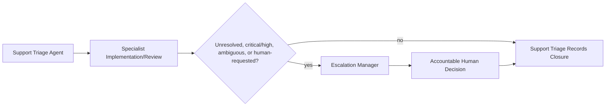

# Support Escalation Workflow

Hermes analog of the cadre workflow playbook. Steps name cadre roles; each role is an installed Hermes skill under the `cadre/` category (skill name = role id). Dispatch each step's role via `delegate_task` (independent steps in one parallel batch), passing that skill's contract + the step's inputs as `context`. Consult `cadre-orchestrator` for role selection, gates, and escalation.

Where the playbook text references `cadre` CLI commands, `roster/` repository paths, or selector machinery, that describes the upstream system: substitute the `cadre-orchestrator` dispatch protocol and its knowledge-retrieval analog; the gate semantics, evidence requirements, and stop conditions still bind.

Runtime findings from closure re-enter the lifecycle at G1 (mission/scope
change), G2 (requirement/control change), or G6 (implementation correction) —
this workflow itself carries no fixed gate of its own.

1. **Dispatcher:** Retrieve authorized support, incident, and role-specific context. Record unavailable, empty, unauthorized, or conflicting knowledge.
2. **Support triage agent:** Sanitize the report, classify severity, confirm scope, preserve evidence, and select the next specialist. Provide only user-safe updates.
3. **Black-box tester:** Reproduce the issue through externally available surfaces and capture observable evidence.
4. **End-user tester:** Validate affected personas, critical journeys, accessibility, and support-message clarity when user experience is in scope.
5. **Specialist implementation or review agents:** Frontend, backend, infrastructure, CI/CD, documentation, security, compliance, evidence, or release roles investigate only the scoped artifact or target.
6. **Escalation manager:** Coordinate unresolved, critical/high, ambiguous, customer-visible, or human-requested cases.
7. **Human escalation:** An accountable human decides on production action, risk acceptance, customer communication, destructive remediation, incident declaration, or policy exception.
8. **Closure:** Support triage records the outcome, evidence, owner, user-safe resolution, follow-up work, and knowledge-store proposal when appropriate. Runtime findings are traced to G1 for mission/scope changes, G2 for requirement/control changes, or G6 for implementation corrections.

Stop when required authority, target identity, blast radius, rollback, or evidence is ambiguous. A support or escalation agent may coordinate and recommend, but cannot approve its own closure for critical/high issues.
