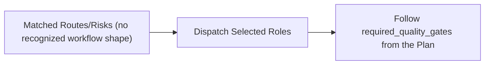

# Unclassified Workflow

Hermes analog of the cadre workflow playbook. Steps name cadre roles; each role is an installed Hermes skill under the `cadre/` category (skill name = role id). Dispatch each step's role via `delegate_task` (independent steps in one parallel batch), passing that skill's contract + the step's inputs as `context`. Consult `cadre-orchestrator` for role selection, gates, and escalation.

Where the playbook text references `cadre` CLI commands, `roster/` repository paths, or selector machinery, that describes the upstream system: substitute the `cadre-orchestrator` dispatch protocol and its knowledge-retrieval analog; the gate semantics, evidence requirements, and stop conditions still bind.

This workflow has no fixed phase/gate/authority shape by design — the
deciding authority is whatever `required_quality_gates`/`human_gates` the
matched routes and risk rules actually produced in the plan.

Emitted when the selector matched at least one route or risk rule (so real roster/reviewers were selected — this is not `needs-triage`) but the matched combination does not fit any of this repository's recognized workflow shapes (new service, product intake, infrastructure/pipeline change, debugging, runtime assurance, production release, rollback, support escalation, knowledge ingestion, agent suite maintenance).

1. Do not assume `unclassified` means low-risk or low-priority — it is a statement about workflow-shape recognition, not about the task's actual impact. Read `matched_routes`, `matched_risks`, and the selected `agents` groups to understand what was actually matched, including each entry's `reasons` — the keywords, keyword groups, and path patterns that fired. An unrecognized combination is often an unexpected route match, and that field names the trigger without a read of `routing.json`.
2. Proceed with the selected `primary`/`reviewers`/`support` roles and `required_quality_gates` exactly as any other plan — `unclassified` changes nothing about dispatch authority, human gates, or approval separation.
3. If the same route/risk combination recurs often enough to warrant its own recognized shape, propose a new workflow (a `roster/workflows/<id>.md` file plus a `_select_workflow()` branch and schema enum entry in `internal/selector/plan.go`/`roster/orchestration/selection.schema.json`) rather than leaving it perpetually unclassified.

This workflow exists specifically so an unrecognized route/risk combination is never silently mislabeled as `new-service` (or any other specific shape) by a catch-all fallback — see `internal/selector/plan.go`'s `_select_workflow()`.
