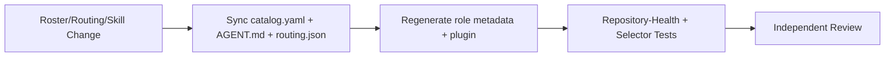

# Agent Suite Maintenance Workflow

This workflow carries no fixed lifecycle gate (neither the `agent-suite-governance`
nor the `orchestration` route declares `quality_gates`); the deciding
authority is whatever `required_quality_gates`/`human_gates` the matched
routes and risk rules actually produced in the plan, same as `unclassified`.

Emitted for routine maintenance of **this repository's own** role catalog,
role definitions, routing rules, shared policy, knowledge-store
configuration, or orchestration tooling — i.e. tasks where the
roster/orchestration machinery itself is the subject of the work, not the
tool dispatching some other change. Typical examples: adding or editing a
role's `AGENT.md`, updating `roster/catalog.yaml` or `catalog-order.txt`,
editing `roster/orchestration/routing.json` or `selection.schema.json`,
changing `roster/shared/` policy defaults, or adding/editing a publishable
`.agents/skills/` entry. This is distinct from `debugging`: a defect report,
a misroute, or a "tune agent"/"routing issue" task about the *behavior* of
the agent suite is `debugging` even when it touches the same files —
`agent-suite-maintenance` is for the routine, non-defect case.

1. **Dispatcher:** Attach the exact role/routing/policy/skill files touched, the catalog entry involved, and any authorized knowledge context. Record unavailable or blocked retrieval.
2. **Application engineer (with debugging-engineer support):** Make the scoped edit — new or updated `AGENT.md` frontmatter, `catalog-order.txt` entry, `routing.json` route/risk rule, shared policy default, or skill content — following `.agents/skills/agent-authoring/SKILL.md`'s required-changes checklist exactly.
3. **Regenerate derived output:** Run `cadre generate-role-metadata` after any frontmatter/catalog-order change, then `cadre generate-plugin --output plugin` (and `port_cline_agents.py` when a role/skill changed) so the committed generated half of `plugin/` and `provider/` stay in sync with the source. `git add` new files first — untracked ones are skipped silently. `roster/RUNBOOK.md` §17, "Regenerating derived output", is the canonical version, including the `generate-authority-aides` step this list omits.
4. **Test-engineer / code-reviewer:** Rerun `roster/orchestration/test` and `roster/shared/test`, confirm `test_repository_health.py` (drift, role count, workflow/schema parity) is green, and add or update selector tests and golden-corpus fixtures for any new or changed route.
5. **Technical writer (support):** Keep hand-maintained role-count and structure prose (`README.md`, `CLAUDE.md`, `roster/RUNBOOK.md`, `docs/role-index.md`, `docs/capability-index.md`, `.claude-plugin/marketplace.json`) synchronized when a role is added or removed.
6. **Independent review:** Route the change to an independent orchestration or code review — the agent that authored the role/routing change does not approve it.
7. **Escalation:** Stop for anything that would move gate-approval, risk-acceptance, or compliance-applicability logic between `roster/` and `kernel/`, or otherwise touch the kernel ownership boundary (`roster/orchestration/test/test_kernel_boundary.py`) — that requires the accountable human/reviewer pairing `orchestration/escalation-policy.md` describes, not routine maintenance.

Completion requires the catalog/routing/policy edit, a clean `cadre generate-role-metadata --check` and `cadre generate-plugin --output plugin --check`, passing `roster/orchestration/test` and `roster/shared/test`, and an independent-review handoff tied to the exact revision.
