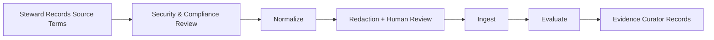

# Knowledge Store Ingestion Workflow

This workflow carries no lifecycle gate — authorization comes from the
Security/Compliance reviewers and the Knowledge Store Steward's own
operator authority (`roster/knowledge-store/AGENT.md`), not a numbered
`G1`-`G10` human gate.

1. Knowledge store steward records source ownership, processing authority, intended use, classification, retention, residency, deletion, tenant, and audience constraints. **Retention is a paper record again.** Issue #184 gave it a queryable destination -- `cadre knowledge ingest --retention-days` wrote a per-message window into cadre's own store -- and that store is recall's now: `ingest` retired with the retrieval engine, and recall records no retention window. Until something replaces it, a retention decision made here lives only in the steward's note, and nothing ages out on its own.
2. Security and compliance reviewers assess sensitive-data handling and external embedding-provider restrictions before real content leaves the staging boundary.
3. Store steward normalizes recognized export fields and samples results against the source. The generic parser does not validate or preserve every canonical-schema field; add a source-specific adapter when fidelity matters.
4. Run redaction and prompt-injection detection. Human-review representative samples and every unexpected sensitive-data category.
5. Ingest into a store partition whose access controls match the source classification. The demo response includes run ID and message/chunk counts; keep parser version, exact embedding provider/model/dimensions, configuration, redaction summary, and approvals in a supplemental steward record.
6. Evaluate retrieval with representative questions, negative access tests, stale/conflicting guidance tests, and citation verification. Preserve evaluated bundles and their integrity hashes because re-ingestion can change content under existing identifiers.
7. Evidence curator records approvals and ingestion evidence without copying raw sensitive content.
8. **Make accepted findings retrievable.** A record proposed with `cadre knowledge propose` and accepted with `cadre knowledge disposition-staged` is still unreachable by any query: staged records live in `staged_records`, retrieval scores `chunks`, and nothing joined the two. `cadre knowledge ingest-accepted` is the step that does, and it is deliberately separate from the disposition -- the steward decides, this executes a decision already made. Idempotent, so re-running skips what is already in the corpus; `--dry-run` reports what it would do; `--id` limits it to named records. It refuses a record whose `untrusted_instruction_risk` is `true` or `unknown`, and ingests at the steward's `disposition.classification_used` rather than the proposer's `proposed_classification`, so a proposer cannot widen classification by asking. It also refuses a record whose `disposition.decided_by` equals its `staged_by`: staging is open to any agent, so ingestion is the last step at which a self-approved record can still be stopped, and it does not assume the two earlier checks held. See `SECURITY.md` § Known limitations for how far that reach actually extends — the `propose`-side check is name-independent, this one compares caller-asserted strings.

   This step did not exist until G-7. For most of the store's life capture worked and the pipeline stopped one action short of usefulness -- findings accumulated, accepted, permanently unreachable, and sessions re-derived from scratch what the store already held.

9. Remove raw staging exports through the approved records process. **Only one of the two deletion paths exists today.** `cadre knowledge delete-staged` removes a *staged* record (never ingested), with evidence retained in `staged_record_deletions` after the record is gone -- that table has no foreign key to what it describes, on purpose, because evidence must outlive its subject. Read it back with `cadre knowledge deletion-evidence-staged`.

   Deleting *ingested* content has no command. `cadre knowledge delete-ingested` and `cadre knowledge retention-report` were real in the Python CLI and went with the Go rewrite; ingested content now lives in a recall store, whose Go API deletes by document or chunk id and whose CLI exposes no delete at all. So there is no steward-facing way to remove ingested content, and nothing reports what has expired. Whether that is rebuilt or declared out of scope is an open decision -- see `roster/knowledge-store/DESIGN-NOTES-deletion-and-retention.md`, which preserves the design the Python implementation carried, and `roster/knowledge-store/SECURITY.md` for what the store does enforce today.

Do not ingest when ownership, consent/authority, classification, provider data-use terms, residency, retention, or deletion obligations are unresolved. The retention obligation lives only in the steward's supplemental record (step 1): nothing records a retention window at ingest, and nothing ages out. That makes the review requirement here stricter rather than looser -- an unresolved retention decision must block ingestion, because there is no classification default to fall back to and no later mechanism that would catch it.
