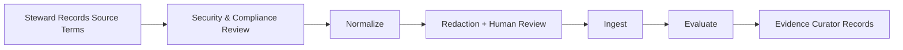

# Knowledge Store Ingestion Workflow

This workflow carries no lifecycle gate — authorization comes from the
Security/Compliance reviewers and the Knowledge Store Steward's own
operator authority (`roster/knowledge-store/AGENT.md`), not a numbered
`G1`-`G10` human gate.

1. Knowledge store steward records source ownership, processing authority, intended use, classification, retention, residency, deletion, tenant, and audience constraints. As of issue #184, retention stops being a paper record kept only here: `cadre knowledge ingest` records a per-message retention window in the store itself (`--retention-days`, or the classification default from config), so step 1's retention decision has a concrete, queryable destination rather than only a steward note.
2. Security and compliance reviewers assess sensitive-data handling and external embedding-provider restrictions before real content leaves the staging boundary.
3. Store steward normalizes recognized export fields and samples results against the source. The generic parser does not validate or preserve every canonical-schema field; add a source-specific adapter when fidelity matters.
4. Run redaction and prompt-injection detection. Human-review representative samples and every unexpected sensitive-data category.
5. Ingest into a store partition whose access controls match the source classification. The demo response includes run ID and message/chunk counts; keep parser version, exact embedding provider/model/dimensions, configuration, redaction summary, and approvals in a supplemental steward record.
6. Evaluate retrieval with representative questions, negative access tests, stale/conflicting guidance tests, and citation verification. Preserve evaluated bundles and their integrity hashes because re-ingestion can change content under existing identifiers.
7. Evidence curator records approvals and ingestion evidence without copying raw sensitive content.
8. **Make accepted findings retrievable.** A record proposed with `cadre knowledge propose` and accepted with `cadre knowledge disposition-staged` is still unreachable by any query: staged records live in `staged_records`, retrieval scores `chunks`, and nothing joined the two. `cadre knowledge ingest-accepted` is the step that does, and it is deliberately separate from the disposition -- the steward decides, this executes a decision already made. Idempotent, so re-running skips what is already in the corpus; `--dry-run` reports what it would do; `--id` limits it to named records. It refuses a record whose `untrusted_instruction_risk` is `true` or `unknown`, and ingests at the steward's `disposition.classification_used` rather than the proposer's `proposed_classification`, so a proposer cannot widen classification by asking.

   This step did not exist until G-7. For most of the store's life capture worked and the pipeline stopped one action short of usefulness -- findings accumulated, accepted, permanently unreachable, and sessions re-derived from scratch what the store already held.

9. Remove raw staging exports through the approved records process. Two commands, two evidence tables, and deletion is never automatic for either: `cadre knowledge delete-staged` removes a *staged* record (never ingested), with evidence retained in `staged_record_deletions` after the record is gone; `cadre knowledge delete-ingested` removes *ingested* content -- messages and their chunks -- steward-only, scoped by `--scope {source|conversation|message}`, always requiring `--reason`, `--deleted-by`, and `--authorized-by`, with evidence retained in the separate `ingested_content_deletions` table before the delete happens. Neither table has a foreign key to what it describes, on purpose: evidence must outlive its subject. `cadre knowledge retention-report` lists expired ingested content read-only -- it never deletes anything, only names what a steward could act on with `delete-ingested`. See `roster/knowledge-store/SECURITY.md` for the full contract and its honest limits.

Do not ingest when ownership, consent/authority, classification, provider data-use terms, residency, retention, or deletion obligations are unresolved. The retention obligation itself is now recorded in the store at ingest time (step 1), not only in a supplemental steward record -- but that does not relax the review requirement here: an unresolved retention decision must still block ingestion, the same as before, rather than being deferred to whatever the classification default happens to resolve to.
